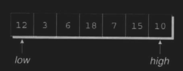
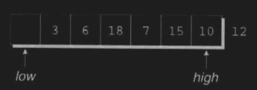
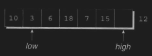
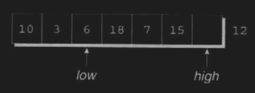
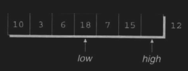
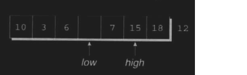
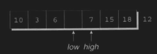
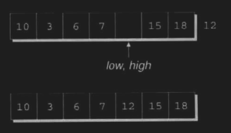

# Chapter 9: Functions - Notes

> *If you have a procedure with ten parameters, you probably missed some*.

A function is simply a series of statements that have been grouped together and given a name.

Functions are the building blocks of C programs. Each function is essentially a small self-contained program with its own declarations and statements. Functions are easier to reason about, allow us to avoid duplicating code and are reusable.

Our programs so far have consisted of just the `main` function. In this chapter, we'll see how to write functions other than `main`, and we'll learn more about `main` itself.

We will also explore arguments, returns, termination and recursion.

***

## 9.1 Defining and Calling Functions

Suppose we often need to compute the average of two `double` values. C doesn't have a baked in `average` function, but we can easily define our own.

```C
double average(double a, double b)
{
    return (a + b) / 2;
}

...

return_type function_name(p_type param_1, ...) 
{ 
    return value;  /* function body */ 
}
```

A function parameter is essentially a cariable whose initial value will be supplied later, when the function is called. The body is the executable section of the function, `average`'s body consists of a single `return` statement. `return` is literal, it **returns** execution to the place from which it was called, in this case with the value `(a + b) / 2`.

To call a function, we write the function name, followed by a list of arguments. e.g. `average(x, y)` is a call of the `average` function on two variables, `x` and `y`. The value of these variables is **copied** into the parameters `a` and `b`, then the body is executed. `x` and `y` don't need to be variables, they can be any values of the correct type.

***

### Program: Computing Averages

```C
// average.c
// computes pairwise averages of three numbers

#include <stdio.h>

double average(double a, double b) {
    return (a + b) / 2;
}

int main(void)
{
    double x, y, z;

    printf("Enter three numbers: ");
    scanf("%lf%lf%lf", &x, &y, &z);
    printf("Average of %g and %g: %g\n", x, y, average(x, y));
    printf("Average of %g and %g: %g\n", y, z, average(y, z));
    printf("Average of %g and %g: %g\n", x, z, average(x, z));

    return 0;
}
```

Notice that the definition of `average` comes before `main`, putting them the other way around will cause problems.

***

### Program: Printing a Countdown

Not all functions return a value. To indicate this, we specify that its return type is `void`. (a type with no value).

```C
// countdown.c
// prints a countdown

#include <stdio.h>

void print_count(int n) {
    printf("T minus %d and counting\n", n);
}

int main(void)
{
    int i;

    for (i = 10; i > 0; i--)
        print_count(i)
    
    return 0;
}
```

```txt
OUTPUT: 
T minus 10 and counting
T minus 9 and counting 
T minus 8 and counting 
T minus 7 and counting 
T minus 6 and counting 
T minus 5 and counting 
T minus 4 and counting 
T minus 3 and counting 
T minus 2 and counting 
T minus 1 and counting 
```

***

### Program: Printing a Pun (Revisited)

Some functions have no parameters at all, like the following function that prints a bad pun every time it's called.

```C
// pun2.c
// prints a bad pun

#include <stdio.h>

void print_pun(void) {
    printf("To C, or not to C: that is the question.\n");
}

int main(void)
{
    print_pun();
    return 0;
}
```

***

### Function Definitions

```C
return_type function_name( parameters ) 
{ 
    declarations;
    statements();
}
```

- Functions may not return arrays, but there are no other restrictions on the return type.
- Specifiying that the return type is `void` indicates that the function doesn't return a value.
- If the return type is omitted in C89, the function is presumed to return a value of type `int`. In C99, it's illegal to omit the return type of a function.

As a matter of style, some people put the return type above the function name. This can be especially useful if the return type is lengthy, like `unsigned long int`.

```C
double
average(double a, double b)
{
    return (a + b) / 2;
}
```

The body of a function can be written with both declarations and statements.

```C
double average(double a, double b)
{
    double sum;         // declaration

    sum = a + b;        // statement
    return sum / 2;     // statement
}
```

In C89, all declarations must come before statements. In C99 and onwards, you can mix declarations and statements so long as any variables used are declared first.

The body of a function can be empty if the return type is void. This can be useful during program development to fill out functions without having to complete them, so we can later come back and write the body.

```C
void do_nothing(void)
{
}
```

***

### Function Calls

A function call consists of a function name followed by a list of arguments, enclosed in parentheses. If the parentheses are missing, the function won't get called. The result is a legal (and meaningless) expression statement that looks correct but has no effect.

```C
average(x, y);
print_count(i);
print_pun();

print_pun;      // WRONG, statement with no effect
```

A call to a non-`void` function is always followed by a semicolon to turn it into a statement.

A non-`void` function produces a value that can be stored in a variable, tested, printed or used in some other way.

```C
double avg = average(x, y);

if average(x, y) > 0)
    printf("Average is positive.\n");

printf("The average is %g\n", average(x, y));
```

The value returned by a non-`void` statement can always be discarded if it's not needed. This is common with `printf`, which returns as a value the number of characters that it prints.

```C
num_chars = printf("Hi, Mom!\n");   // num_chars == 9
```

To make it clear that we're deliberately discarding the return value of a function, C allows us to put `(void)` before the call;

```C
(void) printf("Hi, Mom!\n");
```

Which is just casting the return value as a `void` type. "Casting to `void`" is a euphemism for throwing something away, using `(void)` makes is clear that you deliberately discarded it.

***

### Program: Testing Whether a Number is Prime

```C
// prime.c
// tests whether a number is prime

#include <stdbool.h>
#include <stdio.h>

bool is_prime(int n)
{
    int divisor;

    if (n <= 1)
        return false;
    for (divisor = 2; divisor * divisor <= n; divisor++)
        if (n % divisor == 0)
            return false;
    return true;
}

int main(void)
{
    int n;

    printf("Enter a number: ");
    scanf("%d", &n);

    if (is_prime(n))
        printf("Prime\n");
    else
        printf("Not prime\n");

    return 0;
}
```

`is_prime` demonstrates, a function may have more than one `return` statement. However, we can execute just one of these statements during a given call of the function.

***

## 9.2 Function Declarations

C doesn't actually require you to declare entire functions before you call them. However, the compiler still needs to know that the function exists in advance.
If it encounters a function call and doesn't know how many parameters it should take, or if they're correct, it will assume that the function returns an int properly and attempts to promote the arguments. If it later finds out that the function should have returned differently, it will then throw an error and fail to compile.

One way to avoid the problem of call-before-definition is to arrange the program so that the definition of each function precedes all of its calls. This will solve the issue in some cases, but cause new ones related to structure and readability in others, and may not actually be feasible.

The alternative is to declare each function before calling it. A function declaration provides the compiler with a brief glimpse at a function whose full definition will appear later. A function declaration resembles the first line of a function definition with a semicolon added at the end:

```txt
return-type  function-name  ( parameters ) ;
```

This 'function prototype' must be consistent with the later function declaration that contains the procedure to follow. The prototype provides a complete description of how to call a function, how many arguments to supply, what their types should be and what type of result will be returned.

```C
double average(double a, double b);     // function prototype

int main(void) 
{
    // ...
    double x = average(12.2, 13.5);     // function call
}

double average(double a, double b)      // function definition
{
    return (a + b) / 2;
}
```

Function prototypes do not have to declare the names of a function's parameters, so long as the types are present.

```C
double average(double, double);
```

But it is considered best practice not to omit them ass they help docum,ent the purpose of each parameter and remind the programmer of the order in which arguments must appear.

C99 has adopted the rule that either a declaration or a definition of a function must be present prior to any call of the function. Calling a function for which the compiler has not yet seen a declaration or definition is an error.

***

## 9.3 Arguments

***Parameters*** and ***arguments*** are not the same thing. ***Parameters*** appear in function definitions; they're dummy names that represent values to be supplied when the function is called. ***Arguments*** are expressions that appear in function calls. When the distinction between ***argument*** and ***parameter*** isn't important, ***argument*** can be used to mean either.  

In C, arguments are ***passed by value***; when a function is called, each argument is evaluated and its value assigned to the corresponding parameter. Since the parameter contains a copy of the argument's value, any changes made to the parameter during the execution of a function don't affect the argument.

In effect, each parameter behaves like a variables that's been initialised to the value of the matching argument. This has both advantages and disadvantages; since a parameter can be modified without affecting the corresponding argument, we can use parameters as variables within the function, reducing the number of genuine variables needed.

```C
int power(int x, int n)
{
    int i, result = 1;

    for (i = 1; i <= n; i++)
        result = result * x;

    return result;
}
```

Since n is a *copy* of the original exponent, we can modify it inside the function, thus removing the need for i:

```C
int power(int x, int n)
{
    int result = 1;

    while (n-- > 0)
        result = result * x;

    return result;
}
```

Unfortunately, C's requirement that arguments be passed by value makes it difficult to write certain kinds of functions.

Suppose that we need a function that will decompose a `double` value into an integer part and a fractional part. Since a function can't ***return*** two numbers, we might try passing a pair of variables to the function and have it modify them.

```C
void decompose(double x, long int_part, double frac_part)
{
    int_part = (long) x;    // drops the fractional part of x
    frac_part = x - int_part;
}
```

Suppose we call the function in the following way:

```C
decompose(3.14159, i, d);
```

At the beginning of the call, `3.14159` is copied into `x`, `i`'s value is copied into `int_part`, and `d`'s value is copied into `frac_part`. The statements inside `decompose` then assign `3` to `int_part` and `.14159` to `frac_part`, and the function returns. Unfortunately, `i` and `d` weren't affected by the assignments to `int_part` and `frac_part`, so they have the same value after the call as they did before the call.  

With some more work, `decompose` can be made to work like we intend it to, but we'll need to wait until section 11.4 after covering more of C's features.

***

### Argument Conversions

C allows function calls where the types of the arguments don't match the types of the parameters. The rules for whether the arguments will be converted depend on whether or not the compiler has seen a prototype for the function prior to the call:

- **The compiler has encountered a prototype prior to the call**. The value of each argument is implicitly converted to the type of the corresponding parameter as if by assignment. e.g. if an `int` is passed to a function expecting `double`, the argument is automatically converted to `double`.
- **The compiler has not encountered a prototype prior to the call.** The compiler performs the default argument promotions: 1) `float` argument are converted to `double` 2) the integral promotions are performed, causing `char` and `short` arguments to be converted to `int`.

Relying on the compiler to promote arguments is dangerous.

```C
#include <stdio.h>

int main(void)
{
    double x = 3.0;
    printf("Square: %d\n", square(x));

    return 0;
}

int square(int n)
{
    return n * n;
}
```

At the time `square` is called, the compiler hasn't seen a prototype yet, so it doesn't know that `square` expects an `int`. Instead, it performs default argument promotions on `x`, with no effect.(?)

We can fix this by explicitly casting:

```C
printf("Square: %d\n", square((int) x));
```

But it would be better to provide a prototype for `square` before calling it.  

In fact, in C99 calling `square` without a declaration or definition is an error.  

***

### Array Arguments

Arrays are often used as arguments. When a function parameter is a one-dimensional array, the length of the array can be (and is often) left unspecified.

```C
int f(int a[])  // no length specified!
{
    ...
}
```

The argument can be any one-dimensional array whose elements are of the correct type.

There's just one problem; how does `f` know how long the array is? Unfortunately, C doesn't provide any easy way for a function to determine the length of an array passed to it. Instead, we'll have to supply the length ourselves as an additional argument.

```C
// although we can use the sizeof operator to help determine the length of an array variable, it doesn't give the correct answer for an array parameter:

int f(int a[])
{
    int len = sizeof(a) / sizeof(a[0]);
        // WRONG; not the number of elements in an array
}

// section 12.3 explains why!
```

The following function illustrates the use of one-dimensional array arguments.  

```C
int sum_array(int a[], int n)
{
    int i, sum = 0;

    for (i = 0; i < n; i++)
      sum += a[i];

    return sum;
}
```

When `sum_array` is called, the first argument will be the name of an array, and the second will be its length.

```C
#define LEN 100

int main(void)
{
    int b[LEN], total;
    // ...
    total = sum_array(b, LEN);
    // ...
}
```

Notice that we don't put brackets after an array name when passing it to a function. A function has no way to check that we've passed it the correct array length. We can exploit this fact by telling the function that the array is smaller than it really is.

Suppose that we've onl stored 50 numbers in the b array, even though it can hold 100. We can sum just the first 50 elements by writing:

```C
total = sum_array(b, 50);   // sums first 50 elements
```

Be careful not to tell a function that an array argument is larger than it really is, as this will cause undefined behaviour.

Another important thing to know is that a function is allowed to change the elements of an array parameter, and the change is reflected in the corresponding argument. For example, the following function modifies and array by storing zero into each of its elements.

```C
void store_zeros(int a[], int n)
{
    for (int i = 0; i < n; i++)
      a[i] = 0;
}
```

The call `store_zeros(b, 100);` will store zero into the first 100 elements of the array `b`. This ability to modify the elements of an array argument may seem to contradict the fact that C passes arguments by value. There's not actually a contradiction, but this won't be explained until **Section 12.3**.

If a parameter is a multi-dimensional array, only the length of the first dimension may be omitted when the parameter is declared.

e.g. if we revise `sum_array` to be multidimensional;

```C
#define LEN 10

int sum_two_dimensional_array(int a[][LEN], int n)
{
    int i, j, sum = 0;

    for (i = 0; i < n; i++)
      for (j = 0; j < LEN; j++)
        sum += a[i][j];
    
    return sum;
}
```

Not being able to pass multidimensional arrays with an arbitrary number of columns can be a pain. Forunately, we can often work around this by using arrays of pointers. C99's variable-length array parameters provide an even better solution to the problem.

***

### Variable-Length Array Parameters

C99 added some interesting functionality to array arguments. The first is that Variable-Length Arrays can be used as parameters. Using a variable length array, we can state that `a`'s length is `n`:

```C
int sum_array(int n, int a[n])
{
    ...
}
```

The value of the first parameter (`n`) specifies the length of the second parameter (`a`). Note that the order of the parameters has been switched; order is important when variable-length array parameters are used.

There are several ways to write the prototype for our new `sum_array`;

```C
int sum_array(int n, int a[n]);     // Version 1

int sum_array(int n, int a[*]);     // Version 2a

int sum_array(int, int [*]);        // Version 2b

int sum_array(int n, int a[]);      // Version 3a

int sum_array(int, int[]);          // Version 3b
```

Suppose we wanted to write a function that concatenates two arrays `a` and `b` by copying the elements of `a`, followed by the elements of `b`, into a third array named `c`. The length of `c` is the sum of the lengths of `a` and `b`.

```C
int concatenate(int m, int n, in a[m], int b[n], int c[m+n])
{
    ...
}
```

 Variable-length array parameters with a single dimension - as in all of our examples so far - have limited usefulness. They make a function declaration more descriptive by stating the desired length of an array argument. However, no additional error-checking is performed; it's still possible for an array argument to be too long or too short.

Fortunately, variable-length array parameters are most useful for multidimensional arrays. Earlier we wrote a function that sums the elements in a two-dimensional array, but it was limited to arrays with a fixed size. With VLAs, we can generalise the function to any number of columns;

```C
int sum_two_dimensional_array(int n, int m, int a[n][m])
{
    int i, j, sum = 0;

    for (i = 0; i < n; i++)
      for (j = 0; j < m; j++)
        sum += a[i][j];

    return sum;
}
```

Prototypes for this function include the following;

```C
int sum_two_dimensional_array(int n, int m, int a[n][m]);
int sum_two_dimensional_array(int n, int m, int a[*][*]);
int sum_two_dimensional_array(int n, int m, int a[][m]);
int sum_two_dimensional_array(int n, int m, int a[][*]);
```

***

### Using `static` in Array Parameter Declarations

In C99, you can use `static` in the declaration of array parameters. In the following example, putting `static` in front of the number `3` indicates that the length of `a` is guaranteed to be at least 3:

```C
int sum_array(int a[static 3], int n)
{
    ...
}
```

This has no effect on the behavior of the program. The presence of `static` is merely a hint that may allow a C compiler to generate faster instructions for accessing the array.

If an array parameter has more than one dimension, `static` can be used only in the first dimension e.g. when specifying the number of rows in a two-dimensional array.

***

### Compound Literals

When `sum_array` is called, the first argument is usually the name of an array (the one whose elements are to be summed).

For example, we might call `sum_array` in the following way:

```C
int b[] = {3, 0, 3, 4, 1};
total = sum_array(b, 5);
```

The only problem with this arrangement is that `b` must be declared as a variable and then initialised prior to the call. If `b` isn'tr needed for any other purpose, it can be mildly annoying to create it solely fgor the purpose of calling `sum_array`.

In C99 we can avoid this by using a ***compound literal***; an unnamed array that's created on the fly by specifying which elements is contains.

```C
total = sum_array((int []){3, 0, 3, 4, 1}, 5);
```

In general, a compound literal consists of a type name within parentheses, followed by a set of values enclosed by braces; resembling a cast applied to an initialiser.

Compound literals created inside a function may contain arbitrary expressions, not just constants.  

```C
int i = 1, j = 2, j = 3;
total = sum_array((int[]){2 * i, i + j, j * k}, 3);
```

A compound literal is an `lvalue`, so the values of its elements can be changed. If desired, a compound literal can be made read-only by adding the word `const` to its type, as in `(const int []){5, 4}`

***

## 9.4 The `return` Statement

A non-`void` function must use the `return` statement to specify what value it will return.  

```C
return  expression ;
```

The expression is often just a constant or variable:

```C
return 0;
return status;
```

More complex expressions are possible; it's not unusual to see the conditional operator used in a return expression:

```C
return n >= 0 ? n : 0;
```

When this statement is executed, the expression `n >= 0 ? n : 0` is evaluated first, returning the value of `n` if it's not negative, otherwise it returns `0`.  

`return` statements may appear in functions whose return type is `void`, provided that no expression is given:

```C
return;     // return in a void function
```

If a non-`void` function reaches the end of its body, that is it fails to execute a return statement, the behaviour of the program is undefined if it attempts to use the value returned by the function. Some compilers will issue a warning such as **"control reaches end of non-void function"** if they detect that this might happen.

***

## 9.5 Program Termination

Since `main` is a function, it must have a return type. Normally, this is `int`, which is why the programs we've seen so far have defined `main` in the following way:

```C
int main(void)
{
    ...
}
```

Older C programs often omit `main`'s return type, taking advantage of the fact that it traditonally defaults to `int`.

```C
main()
{
    ...
}
```

But this isn't legal in C99, so it's best to avoid doing it.

The value returned by `main` is a status code that - in some operating systems - can be tested when the program terminates. `main` should return 0 if the program terminates normally; to indicate abnormal termination, `main` should return a value other than 0.

It's good practice to make sure every C program returns a status code, even if there are no plans to use it.

***

### The `exit` Function

Executing a `return` statement in `main` is one way to terminate a program. Another is calling the `exit` function, which belongs to `<stdlib.h>`. The argument passed to `exit` has the same meaning as `main`'s return value: both indicate the program's status at termination.  

```C
exit(0);                // normal termination

exit(EXIT_SUCCESS);     // normal termination

exit(EXIT_FAILURE);     // abnormal termination
```

`EXIT_SUCCESS` and `EXIT_FAILURE` are macros defined in `<stdlib.h>`. The values are implementation defined, typically they're 0 and 1 respectively.

The difference between `return` and `exit` is that `exit` causes program termination regardless of which function calls it. The `return` statement causes program termination only when it appears in the `main` function.  

Some programmers exclusively use `exit` to make it easier to locate all exit points in a program.

***

## 9.6 Recursion

A function is ***recursive*** if it calls itself. For example, the following function computes $n!$ recursively, using the formula $n! = n \times (n - 1)!$

```C
int fact(int n)
{
    if (n <= 1) return 1;
    else        return n * fact(n - 1);
}
```

Some programming languages rely heavily on recursion, while others don't even allow it. C falls somewhere in the middle: it allows recursion, but most C programmers don't use it that often. Let's tract the execution of the statement:

```C
i = fact(3);
```

```txt
    fact(3) finds that 3 is not less than or equal to 1, so it calls 
        fact(2) which finds that 2 is not less than or equal to 1, so it calls
            fact(1) which finds that 1 <= 1, so it returns 1 which causes
        fact(2) to return 2 x 1 = 2, causing
    fact(1) to return 3 x 2 = 6
```

Notice how the unfinished calls of `fact` "pile up" until `fact` is finally passed 1. At that point, the old calls of fact begin to "unwind" one by one, until the original call - `fact(3)` - finally returns with the answer, 6.

Here's another example of recursion, a function that computes $x^n$ using the formula $x^n = x \times x ^ {n-1}$

```C
int power(int x, int n)
{
    if (n == 0)
      return 1;
    else
      return x * power(x, n - 1);
}
```

The call `power(5, 3)` would be executed as follows:

```txt
    power(5, 3) finds that 3 is not equal to 0, so it calls
        power (5, 2), which finds 2 is not equal to 0 so it calls
            power (5, 1), which finds 1 is not equal to 0 so calls
                power (5, 0) which finds 0 == 0, returning 1, causing
            power(5, 1) to return 5 x 1 = 5, causing
        power (5, 2) to return 5 x 5 = 25, causing
    power(5, 3) to return 5 x 25 = 125
```

Incidentally, we can condense the `power` function a bit by putting a conditional expression in the `return` statement:

```C
int power(int x, int n)
{
    return n == 0 ? 1 : x * power(x, n - 1);
}
```

Both `fact` and `power` are careful to test a "termination condition" as soon as they're called. When `fact` is called, it immediately checks whether its parameter is less than or equal to 1. When `power` is called, it first checks whether its second parameter is equal to 0.  

**All recursive functions need some kind of termination condition in order to prevent infinite recursion.**
***

### The Quicksort Algorithm

Neither `fact` nor `power` really required the use of recursion, because each calls itself just one. Recursion is much more helpful for sophisticated algorithms that require a function to call itself two or more times.

Recursion often arises naturally as a result of a technique known as a **divide-and-conquer** algorithm, in which a large problem is divided into smaller pieces that are then tackled by the same algorithm.

A classic example of this type is the sorting algorithm known as ***Quicksort***. Quicksort behaves in the following way (assuming that the array being sorted is indexed from 1 to n):

1) Choose an array element $e$ (the "partitioning element"), then rearrange the array so that elements $1, ..., i - 1$ are less than or equal to $e$, element $i$ contains $e$ and elements $i + 1, ..., n$ are greater than or equal to $e$.
2) Sort elements $1, ..., i - 1$ by using Quicksort recursively
3) Sort elements $i + 1, ..., n$ by using Quicksort recursively

After step 1, element $e$ is in its proper location. Since the elements to the left of $e$ are all less than or equal to it, they'll be in the right place once they're sorted in step 2; the same applies to the elements on the right of $e$.

Step 1 is obviously critical, and there are various methods of partitioning an array, some much better than others. We'll use a technique that's easy to understand but not particularly efficient.

The algorithm relies on two "markers" named *low* and *high*, which keep track of positions within the array. Initially, *low* points to the first element, `a[0]` and *high* points to the last element, `a[n-1]`.



We start by copying the first element into a temporary location elsewhere, leaving a "hole" in the array.



Next, we move the marker *high* across the array from right to left until it points to an element that's smaller than the partitioning element.  



We then copy the element into the hole that *low* points to, which creates a new hole (pointed to by *high*).



We now move *low* from left to right, looking for an element that's larger than the partitioning element.



When we find one, we copy it into the hole that *high* points to.  



This process repeats with *low* and *high* taking turns until they meet somewhere in the middle of the array. At that time, both will point to a hole, we finish by copying the partitioning element into the remaining hole.





At this stage, we've accomplished our objective: all elements to the left of the partitioning element are less than or equal to 12, and all elements to the right are greater than or equal to 12.

Now that the array has been partitioned, we can use Quicksort recursively to sort the first four elements of the array (10, 3, 6, and 7) and the last two (15 and 18).

***

### Program: Quicksort

```txt
Enter 10 numbers to be sorted: 9 16 47 82 4 66 12 3 25 51
In sorted order: 3 4 9 12 16 25 47 51 66 82
```

```C
// qsort.c
// sorts an array of integers using Quicksort algorithm

#include <stdio.h>

#define N 10

void quicksort(int a[], int low, int high);
int split(int a[], int low, int high);

int main(void)
{
    int a[N], i;

    printf("Enter %d numbers to be sorted: ", N);
    for (i = 0; i < N; i++)
        scanf("%d", &a[i]);

    quicksort(a, 0, N - 1);

    printf("In sorted order: ");
    for (i = 0; i < N; i++)
        printf("%d ", a[i]);
    printf("\n");

    return 0;
}

void quicksort(int a[], int low, int high)
{
    int middle;

    if (low >= high) return;
    middle = split(a, low, high);
    quicksort(a, low, middle - 1);
    quicksort(a, middle + 1, high);
}

int split(int a[], int low, int high)
{
    int part_element = a[low];

    for (;;) {
        while (low < high && part_element <= a[high])
            high--;
        if (low >= high) break;
        a[low++] = a[high];

        while (low < high && a[low] <= part_element)
            low++;
        if (low >= high) break;
        a[high--] = a[low];
    }

    a[high] = part_element;
    return high;
}

```

Although this version of Quicksort works fine, it's not the best. There are a number of ways it could be improved, including:

- ***Improving the partitioning algorithm***. Instead of choosing the first element in the array as the partitioning element, it's better to take the median of the first element, the middle element and the last element. The partitioning process itself can also be sped up. In particular, it's possible to avoid the `low < high` tests in the two `while` loops.

- ***Using a different method to sort small arrays.*** Instead of using Quicksort recursively all the way down to arrays with one element, it's better to use a simpler method for small arrays (fewer than ~25 elements).

- ***Making Quicksort nonrecursive.*** Although Quicksort is a recursive algorithm by nature, and is easiest to understand in that form, it's actually more efficient if the recursion is removed.

***

## Functions: Q&A

>**Q:** Do the names of parameters in a function prototype have to match the names given later in the function's definition?  
>
>**A:** No, some programmers take advantage of this fact by giving long names to parameters in the prototype, and then using shorter names in the actual definition.

>**Q:** Why can the first dimension in an array parameter be left unspecified, but not the other dimensions?
>
>**A:** First we need to discuss how arrays are passed in C. As Section 12.3 explains, when an array is passed to a function, the function is given a *pointer* to the first element in the array.
>
> Next we need to know how the subscripting operator works. Suppose that `a` is a one-dimensional array passed to a function. When we write `a[i] = 0;` the compiler generates instructions that compute the address of `a[i]` by multiplying `i` by the size of an array element and adding the result to the address that `a` represents (the pointer passed to the function).  
>
> This calculation doesn't depend on the length of `a`, which explains why we can omit it when defining the function.

> **Q:** Why does my compiler produce a *"control reaches end of non-void function"* warning when it compiles `main`?
>
> **A:** The compiler has noticed that `main`, despite having `int` as its return type, doesn't have a `return` statement. Putting `return 0;` at the end of `main` will keep the compiler happy. This is good practice even if you compiler doesn't object.

***
